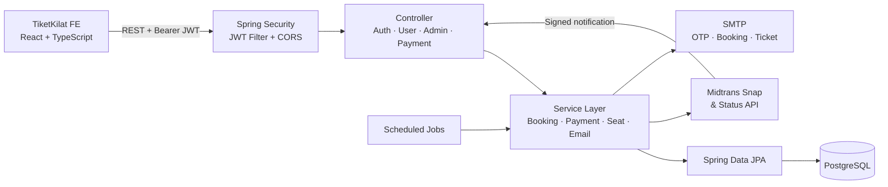

<div align="center">

# ✈️ TiketKilat API

**Backend REST untuk pengalaman pemesanan penerbangan yang cepat, aman, dan terhubung.**

[](https://openjdk.org/projects/jdk/21/)
[](https://spring.io/projects/spring-boot)
[](https://www.postgresql.org/)
[](#dokumentasi-api)

Backend resmi untuk [TiketKilat Frontend](https://github.com/fajarrafsan/TiketKilatFE), dibangun dengan Java 21, Spring Boot, PostgreSQL, JWT, dan Midtrans Snap.

</div>

---

## Tentang TiketKilat

TiketKilat API menangani alur pemesanan dari registrasi hingga e-tiket: katalog penerbangan, data penumpang, pembayaran Midtrans, pemilihan kursi, notifikasi email, serta operasional admin. API bersifat **stateless** dan membatasi akses berdasarkan role `USER` dan `ADMIN`.

### Kemampuan utama

| Area | Yang tersedia |
| --- | --- |
| **Autentikasi** | Registrasi, login JWT, refresh token, logout, BCrypt, serta pemulihan password dengan OTP email |
| **Penerbangan** | Pencarian berdasarkan kota, maskapai, dan tanggal; detail jadwal; status serta ketersediaan otomatis |
| **Booking** | Pemesanan multipart, validasi dokumen KTP, kode booking unik, tenggat pembayaran 15 menit, dan pembatalan |
| **Pembayaran** | Pembuatan transaksi Midtrans Snap, webhook bertanda tangan, sinkronisasi status server-to-server, dan proteksi nominal/order |
| **Kursi & tiket** | Peta kursi, pemilihan kursi setelah lunas, email tiket, QR code, serta boarding pass PDF |
| **Admin** | Dashboard statistik, CRUD penerbangan, histori pemesanan, daftar penumpang, pembatalan booking, dan ekspor Excel |
| **Otomasi** | Scheduler untuk masa berlaku booking, OTP, refresh token, status penerbangan, dan ketersediaan kursi |

## Arsitektur



Struktur aplikasi mengikuti pola monolit berlapis: request melewati filter keamanan, controller meneruskan proses bisnis ke service, lalu data disimpan melalui repository JPA. Integrasi Midtrans dan SMTP tetap berjalan dari backend agar kredensial privat tidak pernah diberikan kepada browser.

## Alur booking dan pembayaran

```text
Daftar / login
    → cari penerbangan
    → buat booking + unggah KTP
    → backend membuat transaksi Snap
    → pengguna membayar di popup Midtrans
    → webhook atau sync-payment memverifikasi status ke Midtrans
    → status menjadi SUDAH_DIBAYAR
    → pilih kursi
    → unduh e-tiket PDF
```

Status sukses dari browser **bukan** sumber kebenaran. Backend mengambil status transaksi langsung dari Midtrans, lalu memeriksa order ID, pemilik booking, nominal, mata uang IDR, status transaksi, dan fraud status sebelum menandai pembayaran sebagai lunas.

## Tech stack

| Teknologi | Peran |
| --- | --- |
| Java 21 + Spring Boot 3.4.4 | Runtime dan fondasi aplikasi |
| Spring Web + Validation | REST controller dan validasi request |
| Spring Security + JJWT | Autentikasi stateless berbasis access/refresh token |
| Spring Data JPA + PostgreSQL | Persistensi data dan query |
| Midtrans Java SDK | Transaksi Snap dan pembayaran |
| Spring Mail | OTP, konfirmasi booking, dan e-tiket melalui SMTP |
| Quartz / Spring Scheduling | Pemrosesan status berkala |
| iText + ZXing | Boarding pass PDF dan QR code |
| Apache POI | Ekspor histori penerbangan ke Excel |
| Springdoc OpenAPI | Swagger UI dan spesifikasi OpenAPI |
| JUnit 5 + Mockito | Unit, controller, security, repository, dan payment tests |

## Menjalankan secara lokal

### Prasyarat

- JDK 21
- PostgreSQL yang sedang berjalan
- Akun SMTP untuk fitur OTP dan email
- Kredensial Midtrans Sandbox untuk mencoba pembayaran
- Frontend TiketKilat, bila ingin menguji alur antarmuka penuh

Maven tidak perlu dipasang terpisah karena repository sudah menyertakan Maven Wrapper.

### 1. Clone repository

```bash
git clone https://github.com/fajarrafsan/TiketKilatBE.git
cd TiketKilatBE
```

### 2. Siapkan database

Buat database PostgreSQL lokal. Nama default yang digunakan contoh konfigurasi adalah `tiket`:

```sql
CREATE DATABASE tiket;
```

Skema aplikasi dikelola oleh Hibernate dengan `spring.jpa.hibernate.ddl-auto=update` pada konfigurasi lokal saat ini.

### 3. Buat konfigurasi lokal

Salin template environment, kemudian isi nilainya hanya di file `.env` lokal.

**Windows PowerShell**

```powershell
Copy-Item .env.example .env
```

**macOS / Linux**

```bash
cp .env.example .env
```

Variabel yang perlu diperiksa:

| Variabel | Kegunaan |
| --- | --- |
| `DB_URL`, `DB_USERNAME`, `DB_PASSWORD` | Koneksi PostgreSQL |
| `JWT_SECRET`, `JWT_EXPIRATION_MS` | Tanda tangan dan masa berlaku access token |
| `SERVER_PORT` | Port API; default lokal `8090` |
| `APP_BASE_URL` | Base URL backend; default lokal `http://localhost:8090` |
| `APP_CORS_ORIGINS` | Daftar origin frontend yang diizinkan, dipisahkan koma |
| `MAIL_HOST`, `MAIL_PORT`, `MAIL_USERNAME`, `MAIL_PASSWORD` | Pengiriman OTP dan email transaksi |
| `ADMIN_EMAIL`, `ADMIN_PASSWORD` | Pembuatan admin awal; dilewati jika password kosong |
| `MIDTRANS_SERVER_KEY`, `MIDTRANS_CLIENT_KEY` | Kredensial dari environment Midtrans yang sama |
| `MIDTRANS_IS_PRODUCTION` | Gunakan `false` untuk Sandbox |

> [!IMPORTANT]
> Jangan commit `.env`, password database, app password email, JWT secret, atau Midtrans Server Key. File `.env.example` hanya berisi nama variabel dan placeholder aman.

### 4. Jalankan API

**Windows**

```powershell
.\mvnw.cmd spring-boot:run
```

**macOS / Linux**

```bash
./mvnw spring-boot:run
```

API tersedia secara default di `http://localhost:8090`.

## Dokumentasi API

Setelah backend berjalan:

- **Swagger UI:** [http://localhost:8090/swagger-ui/index.html](http://localhost:8090/swagger-ui/index.html)
- **OpenAPI JSON:** [http://localhost:8090/v3/api-docs](http://localhost:8090/v3/api-docs)
- **Catatan integrasi frontend:** [`REST_API_DRAFT.md`](./REST_API_DRAFT.md)

Klik **Authorize** pada Swagger UI lalu masukkan access token sebagai Bearer token untuk mencoba endpoint terproteksi. Karena `REST_API_DRAFT.md` merupakan catatan kerja, gunakan Swagger dan implementasi controller sebagai referensi kontrak terkini.

### Grup endpoint

| Prefix | Akses | Cakupan |
| --- | --- | --- |
| `/auth/**` | Publik | Daftar, login, refresh token, logout, OTP, dan reset password |
| `/user/**` | `USER` atau `ADMIN` | Katalog, booking, pembayaran, kursi, tiket, riwayat, dan profil |
| `/admin/**` | `ADMIN` | Operasional penerbangan, booking, penumpang, dashboard, dan ekspor |
| `POST /payment/notification` | Publik untuk Midtrans | Penerimaan notification webhook yang diverifikasi backend |

Sebagian besar response JSON dibungkus dalam bentuk `ResponseApi`. Endpoint unduh PDF dan ekspor Excel mengembalikan file biner secara langsung.

## Menjalankan test

Pastikan konfigurasi PostgreSQL untuk environment test dapat diakses, karena suite mencakup pengujian repository selain unit test berbasis mock.

**Windows**

```powershell
.\mvnw.cmd test
```

**macOS / Linux**

```bash
./mvnw test
```

Area yang dilindungi test mencakup JWT/filter keamanan, query pencarian penerbangan, sinkronisasi pembayaran, validasi response Midtrans, pembaruan status pembayaran, dan pembatalan booking kedaluwarsa.

## Struktur proyek

```text
TiketKilatBE/
├── src/main/java/com/projekan/tiket_pesawat/
│   ├── config/          # Security, Swagger, Midtrans, dan admin awal
│   ├── controllers/     # Endpoint auth, user, admin, dan payment
│   ├── dto/             # Kontrak request/response
│   ├── filters/         # Validasi Bearer JWT
│   ├── handler/         # Respons kegagalan autentikasi/otorisasi
│   ├── models/          # Entity serta enum domain
│   ├── repository/      # Spring Data JPA repositories
│   ├── scheduler/       # Lifecycle booking, token, OTP, dan penerbangan
│   ├── services/        # Aturan bisnis dan integrasi eksternal
│   └── utils/           # Utilitas JWT
├── src/main/resources/
│   ├── templates/html/  # Template email transaksi
│   └── application.properties
├── src/test/java/       # Unit dan integration tests
├── .env.example         # Template konfigurasi aman
├── REST_API_DRAFT.md    # Catatan kontrak untuk frontend
├── pom.xml
└── README.md
```

## Catatan keamanan dan produksi

- Endpoint `/user/**` membutuhkan JWT dengan role `USER` atau `ADMIN`; `/admin/**` hanya menerima role `ADMIN`.
- Password disimpan menggunakan BCrypt. Refresh token dapat dicabut saat logout dan diproses masa berlakunya oleh scheduler.
- Upload identitas wajib berupa JPG, PNG, atau PDF dengan ukuran maksimal 2 MB. Pada konfigurasi saat ini file disimpan di `uploads/ktp/` dan direktori tersebut tidak dilacak Git.
- Untuk produksi, simpan dokumen identitas di private object storage, batasi akses, aktifkan enkripsi, tetapkan kebijakan retensi, dan jangan menyajikan folder upload sebagai static asset.
- Midtrans **Server Key hanya boleh berada di backend**. Frontend cukup menggunakan Client Key publik dari environment yang sama.
- Notification URL Midtrans harus menunjuk ke endpoint backend yang dapat dijangkau internet, yaitu `<base-url-publik>/payment/notification`. `localhost` tidak dapat menerima webhook dari Midtrans tanpa tunnel.
- Gunakan HTTPS, JWT secret acak yang panjang, kredensial database terbatas, secret manager, origin CORS eksplisit, dan `MIDTRANS_IS_PRODUCTION=true` hanya dengan production keys.
- Scheduler booking membatalkan pesanan yang masih `BELUM_DIBAYAR` setelah tenggat, tetapi pembayaran yang telah terverifikasi dilindungi agar tidak ditimpa menjadi batal.

## Repository terkait

- **Frontend:** [fajarrafsan/TiketKilatFE](https://github.com/fajarrafsan/TiketKilatFE)
- **Backend:** [fajarrafsan/TiketKilatBE](https://github.com/fajarrafsan/TiketKilatBE)

---

<div align="center">

**TiketKilat** · Terbang lebih mudah, dari pencarian sampai boarding pass.

</div>
